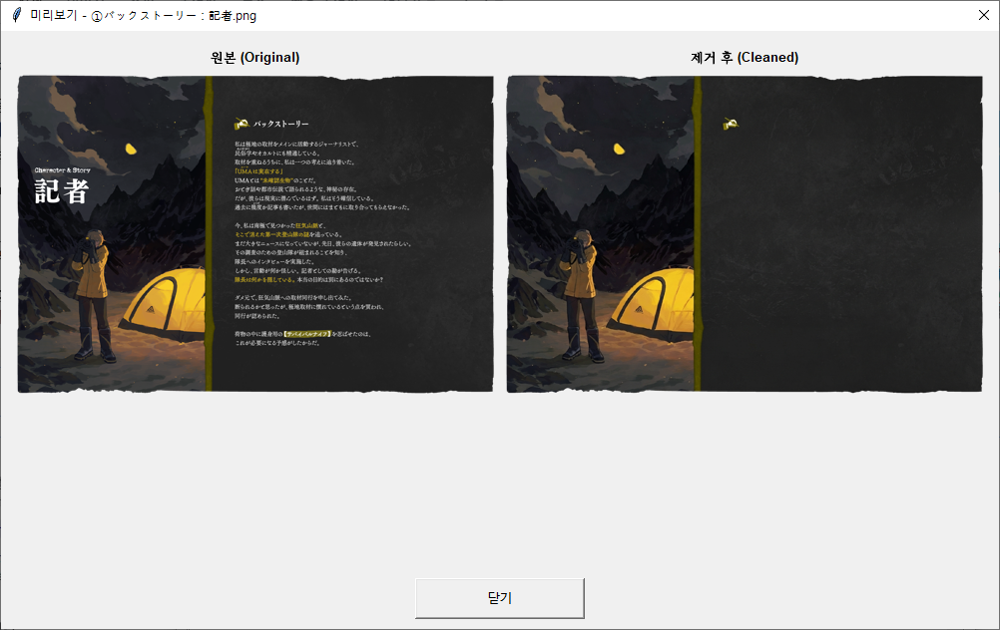

# TRPG/Murder Mystery Translator (v0.5 beta)

TRPG 시나리오 및 머더 미스터리 텍스트를 한국어로 자연스럽게 번역하고 교정하는 도구입니다. 최신 Gemini AI를 활용하여 높은 품질의 번역과 이미지 글자 제거 기능을 제공합니다.

## ✨ 주요 기능

- **자연스러운 번역 (v0.1~v0.4)**: Gemini AI를 사용하여 문맥에 맞는 매끄러운 한국어 번역 제공.
- **이미지 글자 제거 (v0.5 beta)**: 배경을 손상시키지 않고 이미지 내 외국어 글자만 깔끔하게 제거.
- **용어집 관리**: 고유명사 자동 추출 및 사용자 지정 사전 적용 가능.
- **DOCX 서식 보존**: 워드 문서 출력 시 원본의 색상과 폰트 스타일 최대한 유지.
- **PDF 이미지 선택**: 필요한 페이지만 골라서 번역 가능.

## 📸 실행 예시 (Screenshot)

*(v0.5 이미지 글자 제거(preview) 기능을 통한 일어 텍스트 제거 예시)*

## 🚀 시작하기

1. **[Releases](https://github.com/poha-dev/MM-TRPG-Translator/releases)** 탭에서 최신 버전의 실행 파일(`MM_TRPG_Translator_v0.5.exe`)을 다운로드합니다.
2. 프로그램을 실행하고 **설정/정보** 탭에서 [Google Gemini API Key](https://aistudio.google.com/app/apikey)를 입력합니다.
3. 원하는 탭(1차 번역, 2차 교정, 이미지 글자 제거)을 선택하여 작업을 시작하세요.

## 📖 사용 설명서
상세한 사용법은 실행 파일과 함께 제공되는 `manual.html`을 참고해 주세요.

## 🛠 제작 및 문의
- **제작자**: 포하
- **이메일**: kapoha.dev@gmail.com
- **커뮤니티**: [팬비닛 (치지직)](https://fanbinit.us/)
- **후원**: [Buy Me a Coffee ☕](https://buymeacoffee.com/poha)

## ⚠️ 저작권 주의사항 (Copyright Warning)

- 본 프로그램은 번역 및 이미지 처리를 돕는 **자동화 도구**입니다.
- 번역 대상이 되는 시나리오, 텍스트, 이미지의 저작권은 **원작자(라이선스 보유자)**에게 있습니다.
- 사용자는 해당 저작물을 번역하고 배포함에 있어 저작권법을 준수해야 하며, 이를 위배하여 발생하는 모든 법적 책임은 **사용자 본인**에게 있습니다.
- 원작자의 허가 없는 상업적 이용이나 무단 배포는 금지됩니다.

## 📄 License

This project is licensed under the **MIT License + Commons Clause**.

- ✅ 개인 비상업적 사용 허용
- ✅ 커뮤니티 내 공유 허용
- ✅ 차기 버전부터 소스코드 공개 및 수정 허용 예정
- ❌ 상업적 이용 및 판매 금지
- ❌ 무단 재배포 금지

> 📝 **v0.5는 실행 파일(exe)만 배포됩니다. 소스코드는 차기 버전에서 공개 예정입니다.**

Copyright (c) 2026 포하

---

> 🤖 이 프로그램은 AI 툴과의 협업을 통해 제작되었습니다.
