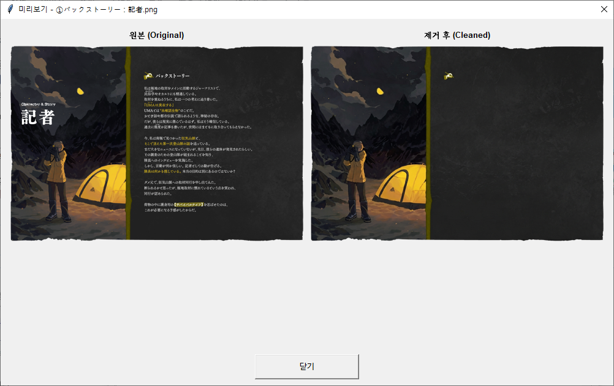

# TRPG / Murder Mystery Translator (v0.7)

일본어 TRPG 시나리오 및 머더 미스터리 텍스트를 한국어로 자연스럽게 번역·교정하고,
코코포리아(CoCoFolio) 룸 이미지를 번역본으로 교체하는 통합 도구입니다.
Google Gemini AI를 활용합니다.

## ✨ 주요 기능

| 기능 | 설명 |
|---|---|
| **1차 번역** | PDF·TXT·이미지 파일을 Gemini AI로 한국어 번역. 용어집(고유명사 사전) 자동 추출·적용 |
| **2차 교정** | 번역 결과물을 AI가 재검토하여 자연스러운 한국어로 다듬기 |
| **DOCX 서식 보존** | 워드 출력 시 원본의 **글자 색상·볼드·하이라이트** 서식 보존 |
| **PDF 이미지 추출** | PDF에 포함된 이미지를 원본 해상도 그대로 파일로 내보내기 |
| **이미지 글자 제거** *(beta)* | 배경을 보존하면서 이미지 내 일어/영문 텍스트만 제거 |
| **코코포리아 룸 셋팅** | 룸 ZIP 이미지를 번역본으로 교체하고 `__data.json` 해시 참조 자동 업데이트 |

## 📸 스크린샷


*이미지 글자 제거 전/후 비교 (v0.5)*

## 🚀 시작하기

1. **[Releases](https://github.com/poha-dev/MM-TRPG-Translator/releases)** 탭에서 최신 버전 실행 파일(`MM_TRPG_Translator_vX.X.exe`)을 다운로드합니다.
2. 프로그램을 실행하고 **설정/정보** 탭에서 [Google Gemini API Key](https://aistudio.google.com/app/apikey)를 입력합니다.
3. 원하는 탭을 선택해 작업을 시작하세요.

> **기본 모델**: `gemini-3-flash-preview`
> 다른 모델은 [Google AI 공식 문서](https://ai.google.dev/gemini-api/docs/models?hl=ko)에서 확인하세요.

## 🔧 개발 환경 설정

```bash
git clone https://github.com/poha-dev/MM-TRPG-Translator.git
cd MM-TRPG-Translator

python -m venv venv
venv\Scripts\activate        # Windows
pip install -r requirements.txt

# API 키 설정 (settings.json.example 참고)
cp settings.json.example settings.json
# settings.json 에서 api_key 값을 실제 키로 변경

python main.py
```

## 📖 사용 설명서

상세한 사용법은 `manual.html`을 브라우저로 열어 확인하세요.

## ⚠️ 저작권 주의사항

- 본 프로그램은 번역 및 이미지 처리를 돕는 **자동화 도구**입니다.
- 번역 대상 시나리오·텍스트·이미지의 저작권은 **원작자**에게 있습니다.
- 번역물 배포 시 저작권법을 준수하세요. 이를 위반하여 발생하는 모든 법적 책임은 **사용자 본인**에게 있습니다.
- 원작자 허가 없는 상업적 이용 및 무단 배포는 금지됩니다.

## 📄 License

This project is licensed under the **MIT License + Commons Clause**.

- ✅ 자유롭게 사용, 수정, 배포 가능
- ✅ 출처(포하) 표기 필수
- ❌ 상업적 판매 및 서비스화 금지

Copyright (c) 2026 포하
